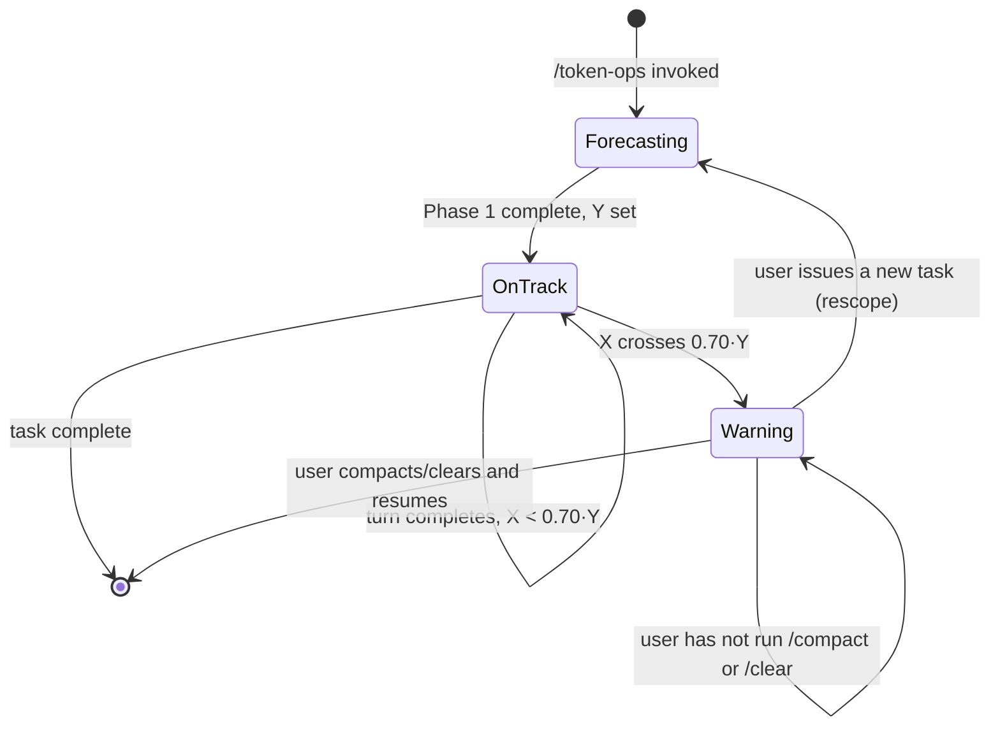

# Architecture

## System Overview

`token-ops` is not software in the conventional sense — it is a single Claude Code **command** (`commands/token-ops.md`): a plain-Markdown behavioral protocol that Claude reads and follows when the user types `/token-ops`. There is no process, no server, no persisted state outside the conversation itself. The "system" is the conversation: Claude's own responses carry the state (the forecast, the running usage estimate) turn over turn.

The central architectural principle is **self-reporting under an explicit contract**: Claude is instructed to produce a specific, parseable status line on every turn, and to take a specific action (pause, summarize, prompt) when a threshold condition is met. There is no external verifier — the protocol relies on Claude estimating its own token consumption from observable signals (lines read, characters written, thinking effort) and adhering to the reporting format without being reminded each turn.

### Top-Level Architecture

```
     User                          Claude Code session                 Filesystem
      │                                    │                               │
      │  /token-ops <task>                 │                               │
      │───────────────────────────────────►│                               │
      │                                     │  read commands/token-ops.md   │
      │                                     │  (installed at                │
      │                                     │  ~/.claude/commands/)         │
      │                                     │                               │
      │                          ┌──────────▼──────────┐                   │
      │                          │  PHASE 1: FORECAST   │                   │
      │                          │  scope files, build  │                   │
      │                          │  budget table, state  │                   │
      │                          │  total as Y           │                   │
      │                          └──────────┬──────────┘                   │
      │◄─────────── forecast table ─────────│                               │
      │                                     │                               │
      │  (task proceeds — tool calls,       │                               │
      │   file reads, edits, turns)         │                               │
      │                                     │                               │
      │                          ┌──────────▼──────────┐                   │
      │                          │  PHASE 2: MONITOR    │                   │
      │                          │  every turn: emit    │                   │
      │                          │  BUDGET STATS header │                   │
      │                          │  update X, Z          │                   │
      │                          └──────────┬──────────┘                   │
      │◄──── [BUDGET STATS: ...] + reply ───│                               │
      │                                     │                               │
      │                          X/Y ≥ 0.70 ?                               │
      │                                     │  yes                          │
      │                          ┌──────────▼──────────┐                   │
      │                          │  WARNING GATE         │                   │
      │                          │  pause new tool calls │                   │
      │                          └──────────┬──────────┘                   │
      │                                     │  write state summary          │
      │                                     │───────────────────────────────►│
      │                                     │                    scratchpad/  │
      │                                     │                    summary.md   │
      │◄────── prompt: /compact or /clear ──│                               │
      │                                     │                               │
```

---

## Component Map

### The command file — `commands/token-ops.md`

**Location**: `commands/token-ops.md` (repo), installed to `~/.claude/commands/token-ops.md` (runtime)
**Responsibility**: Defines the entire behavior of `/token-ops` — both phases, the exact BUDGET STATS format, and the warning-gate actions.
**Interfaces**: Invoked as `/token-ops [task description]` in any Claude Code session. `$ARGUMENTS` is substituted with whatever text follows the command.
**Dependencies**: None beyond Claude Code's command-loading mechanism. It is plain Markdown — no frontmatter, no `allowed-tools` restriction, no external scripts or hooks.

**Internal structure** (sections within the single file):
```
token-ops.md
├── Preamble           — reads $ARGUMENTS, asks for a task if empty
├── Phase 1: Forecast   — pre-computation budget table + rules
└── Phase 2: Monitor    — per-turn header format + 70% warning gate
```

This is the only component. There is no separate parser, renderer, or state store — Claude executes the instructions directly as part of normal turn generation.

---

## Data Flow

### Primary Flow: One `/token-ops` invocation across a session

```
  ┌─ Turn 0 (invocation) ────────────────────────────────────────────┐
  │  User: /token-ops <task>                                          │
  │  Claude: (no tool calls yet)                                      │
  │          → builds forecast table:                                 │
  │              baseline ~25,000                                     │
  │            + file-read cost (named files × ~5 tok/line)           │
  │            + reasoning cap (2,000–15,000 by complexity)            │
  │            + output estimate                                      │
  │            = Y (allocated budget)                                 │
  │  Claude: "Allocated budget: ~Y tokens."                            │
  └────────────────────────────────────────────────────────────────┘
                              │
  ┌─ Turn 1..N (work) ────────▼────────────────────────────────────────┐
  │  Claude opens EVERY reply with:                                    │
  │    [BUDGET STATS: Used approx: X / Allocated: Y                    │
  │                    | Current Context Depth: Z tokens               │
  │                    | Status: ON-TRACK / WARNING]                   │
  │                                                                     │
  │  X updates incrementally each turn (never resets, never            │
  │  recomputed from scratch) as work happens.                         │
  │  Z tracks total conversation context, independent of Y.            │
  └────────────────────────────────────────────────────────────────┘
                              │  X / Y crosses 0.70
                              ▼
  ┌─ Warning turn ─────────────────────────────────────────────────────┐
  │  Status flips to WARNING. Claude:                                  │
  │    1. Stops starting new tool calls / edits                        │
  │    2. Writes a state summary to a scratchpad temp file             │
  │       (what's done, what's left, key paths, key decisions)         │
  │    3. Tells the user the file path and prompts /compact or /clear  │
  │    4. Waits — does not proceed automatically                       │
  └────────────────────────────────────────────────────────────────┘
                              │  (optional) user gives a new task
                              ▼
  ┌─ Rescope ───────────────────────────────────────────────────────────┐
  │  Treated as a fresh Phase 1: X resets, Y is recomputed.             │
  │  The old forecast is not silently carried forward.                 │
  └────────────────────────────────────────────────────────────────┘
```

### BUDGET STATS state machine



---

## Data Model

There is no persisted data model — all state lives in the conversation as plain values Claude tracks in its own reasoning and restates each turn:

```
Session budget state (conversational, not stored)
  ├── Y : int      — allocated budget, tokens (set once in Phase 1, fixed until rescope)
  ├── X : int      — cumulative used estimate, tokens (monotonically non-decreasing per task)
  ├── Z : int      — current total context depth, tokens (independent of Y; can exceed Y)
  └── Status : enum — ON-TRACK | WARNING, derived as WARNING when X ≥ 0.70 × Y
```

The one artifact that *is* written to disk is the warning-gate summary file, placed under the scratchpad directory, containing: what's done, what's left, key file paths, and key decisions — enough for the user (or a fresh session after `/clear`) to resume.

---

## Key Design Decisions

### Estimate-based, not instrumented

**Context**: Claude Code does not expose an API for Claude to query its own exact token consumption mid-conversation.
**Options considered**: (a) Wait for tooling that exposes real counts; (b) have Claude estimate from observable signals (lines read, chars written, thinking effort).
**Decision**: (b) — heuristic self-estimation, biased toward overestimating rather than underestimating.
**Consequences**: The forecast and BUDGET STATS numbers are directionally useful, not exact. This is acceptable because the goal is an early warning, not precise accounting — see [PURPOSE.md](PURPOSE.md) for the non-goal of precision.

### Two separate numbers: task budget (X/Y) vs. context depth (Z)

**Context**: A task can be "on budget" for its own scope while the surrounding conversation's total context is still large (e.g., a long session with several prior tasks).
**Options considered**: Track only one number; track two.
**Decision**: Track both — X/Y for the current task's allocation, Z for total conversation context health.
**Consequences**: The warning gate fires on X/Y (task-scoped), but Z is surfaced every turn so context-window health stays visible even when the current task itself is on-track.

### Hard behavioral gate at 70%, not just a display number

**Context**: A budget readout that's purely informational is easy to ignore until the session is already in trouble.
**Options considered**: Display-only status line; display + mandatory pause-and-summarize action at a threshold.
**Decision**: The latter — crossing 70% forces a concrete sequence (pause, write summary, prompt for `/compact`/`/clear`, wait).
**Consequences**: Guarantees a recovery checkpoint exists before the context window is actually exhausted, at the cost of one extra round-trip when the threshold fires.

### Plain command, not a triggered skill

**Context**: Claude Code supports both explicit `/command`s and auto-triggered skills (matched by description).
**Options considered**: Skill (auto-triggers when Claude judges a task is complex); command (only runs when the user explicitly types it).
**Decision**: Command — this repo's parent collection ([bsommers/claude-skills](https://github.com/bsommers/claude-skills)) uses the convention that deliberately user-triggered actions are commands, not skills (see that repo's `ARCHITECTURE.md`).
**Consequences**: The user must remember to invoke `/token-ops` at the start of a task they want budgeted; it will not silently activate on its own judgment of task complexity.

---

## External Dependencies

| Dependency | Type | Purpose |
|------------|------|---------|
| Claude Code | CLI/runtime | Loads `~/.claude/commands/*.md` and executes `/command` invocations; provides the scratchpad directory the warning gate writes to |

No databases, queues, network calls, or package dependencies.

---

## Known Limitations

- **No ground truth**: Token counts are Claude's own estimates from heuristics (~5 tokens/line for reads, rough effort-to-token mapping for thinking). They can drift from actual usage in either direction, though the protocol biases toward overestimating.
- **No cross-turn enforcement mechanism**: The BUDGET STATS header is a behavioral instruction, not a harness-enforced feature — if a very long session causes the instruction itself to fall out of the effective context, Claude could stop emitting it. There is no external watchdog.
- **Single-task scope**: The protocol resets on a new task rather than accumulating a session-wide ledger across multiple `/token-ops` invocations.
